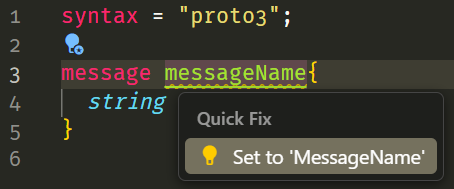
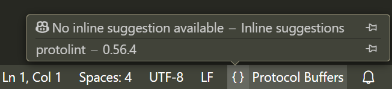

# [`protolint`] for Visual Studio Code

Integrates [`protolint`] into VS Code.

## ⚠️ Warning

`protolint` is designed to work only with files on disk. To implement the
lint-on-type functionality in VS Code, the text of used `.proto` is saved in a
subdirectory inside the system's temporary directory. The subdirectory path is
displayed in the extension output after activation. This subdirectory is
periodically cleaned up.

It leads to several specific behaviors, such as:

- Some `.proto` files are stored not only in their usual directories.
- Additional operations of writing and reading from disk occur.

If this is unacceptable for your workflow, please refrain from using this
extension.

After uninstalling this extension, you may need to manually delete any remaining
files from the system's temporary folder.

## 📀 Installation

To use this extension, you need to install [`protolint`] via any convenient
method. Follow instructions at
[https://github.com/yoheimuta/protolint#installation](https://github.com/yoheimuta/protolint#installation).

The minimum recommended version is `0.55.4`. Older versions may have issues with
the autofix feature.

## ⚙️ Configuration

### `protolint.command`

[`⚙️protolint.command`] setting specifies the command to run `protolint` or the
absolute path to its executable file.

If `protolint` is added to the system's `PATH`, typically the default
configuration should work correctly.

Relative paths must start with a `./` and are supported only for Folder
settings. In that case, the path will be resolved relative to the root of the
corresponding Workspace Folder.

For example, if you've installed `protolint` into your project through `npm`,
you can set the following value for the Workspace Folder setting:

```text
./node_modules/protolint/bin/protolint
```

On Windows, you can omit the `.exe` file extension, so the example configuration
works across all operating systems.

## ✨ Features

### 🔍 Lint-on-Type

Diagnostics generated by `protolint` update automatically when editing a
`.proto` file without saving it.

The diagnostics for untitled protobuf documents is provided only when there is a
protobuf language extension active in VS Code and the document language ID is
`"proto3"`.

### 💡 Quick Fixes

Some problems allow applying granular quick fixes directly.



### 💡 Autofix

`protolint lint -fix` corrections are applied to the selected document while
keeping the original `.proto` file unchanged on disk.

Use the editor command `protolint.editorAutofix` to autofix the active document.

### 📐 Support for `.protolint.yaml`

The extension respects the `.protolint.yaml` configuration file but has some
limitations:

- File name must exactly match `.protolint.yaml` (case-sensitive).
- Only supported in single-folder and [multi-root workspace] modes, considering
  only `.protolint.yaml` located in the root of a Workspace Folder. For
  multi-root workspaces, only the closest Workspace Folder’s `.protolint.yaml`
  is used.
- Untitled protobuf documents do not inherit these configurations.

### 📂 [Multi-Root Workspace][multi-root workspace] Support

Different versions of the `protolint` binary can be set up per Workspace Folder.

### 💬 Language Status Item

A language status item shows the `protolint` version used for the active
`.proto` file.



## 📄 License

This project is licensed under the terms of the MIT license.

## 📜 Attribution

This extension uses the utility [`protolint`].

The icon design was inspired by the `TSLint` logo.

## 🌟 Help Us Grow

If you found this extension useful, please rate it on the Visual Studio
Marketplace and give us a star on GitHub. Your support helps more people
discover and benefit from our tool. Thank you!

## 🤝 Contributing

Will be documented later.

[`protolint`]: https://github.com/yoheimuta/protolint
[`⚙️protolint.command`]: vscode://settings/protolint.command
[multi-root workspace]:
    https://code.visualstudio.com/docs/editing/workspaces/multi-root-workspaces
